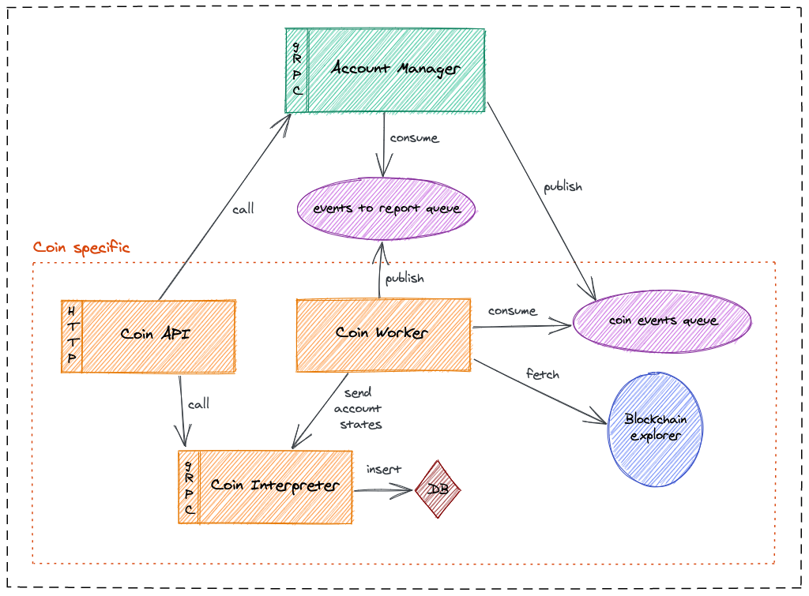

# Lama

Synchronization and management of account states (transactions, balance, ...) across Blockchain protocols.

Main features of Lama are:
- Scalable and stateless components
- Event-driven architecture
- Account manager component for handling account metadata and sending sync event messages
- Easy support of new coin integration by having coin specific components:
  * Worker: fetching data from blockchain
  * Interpreter: computing and inserting data (operations, balance, ...)
  * Api: exposing http endpoints to get synced transactions, estimate fees, create and broadcast transactions

## How Lama works?

## Account manager

The account manager handles account registration and unregistration and emits events to the dedicated coin worker.
Please refer to the [account manager README][account-manager] for more details on how it works.

### Run through docker (recommended)

Install [docker][docker] then run `docker-compose up account-manager`.

This will create a PostgreSql, a RabbitMQ, a Redis and the latest published image of the lama account manager.

This will also apply migration on the PostgreSql database through [flyway][flyway].

Please have a look on `docker-compose.yml` file for more details on the configuration.

#### Build and publish image in local

`sbt accountManager/assembly && sbt accountManager/docker`

### Run manually

Please refer to the [getting started][account-manager-getting-started] section of the account manager README.

## Coin integration

### Bitcoin Worker

#### Run through docker (recommended)

Run `docker-compose up bitcoin-worker`.

Please have a look on `docker-compose.yml` file for more details on the configuration.

##### Build and publish image in local

Import dependencies of the project :

    git submodule init
    git submodule upgrate --remote --recursive

And then run `sbt bitcoinWorker/assembly && sbt bitcoinWorker/docker`

#### Run manually

Please refer to the [getting started][bitcoin-worker-getting-started] section of the bitcoin worker README.

### Bitcoin Interpreter

#### Run through docker (recommended)

Run `docker-compose up bitcoin-interpreter`.

Please have a look on `docker-compose.yml` file for more details on the configuration.

##### Build and publish image in local

Import dependencies of the project :

    git submodule init
    git submodule upgrate --remote --recursive

Then run `sbt bitcoinInterpreter/assembly && sbt bitcoinInterpreter/docker`

#### Run manually

Please refer to the [getting started][bitcoin-interpreter-getting-started] section of the bitcoin interpreter README.

### Bitcoin REST API

#### Run through docker (recommended)

Run `docker-compose up service`.

Please have a look on `docker-compose.yml` file for more details on the configuration.

##### Build and publish image in local

Import dependencies of the project :

    git submodule init
    git submodule upgrate --remote --recursive

Then run `sbt bitcoinApi/assembly && sbt bitcoinApi/docker`

#### Run manually

Please refer to the [getting started][bitcoin-api-getting-started] section of the bitcoin api README.

[docker]: https://docs.docker.com/get-docker/
[flyway]: https://flywaydb.org/
[account-manager]: https://github.com/LedgerHQ/lama/tree/master/account-manager
[account-manager-getting-started]: account-manager/README.md#getting-started
[bitcoin-api-getting-started]: coins/bitcoin/api//README.md#getting-started
[bitcoin-interpreter-getting-started]: coins/bitcoin/interpreter/README.md#getting-started
[bitcoin-worker-getting-started]: coins/bitcoin/worker/README.md#getting-started
