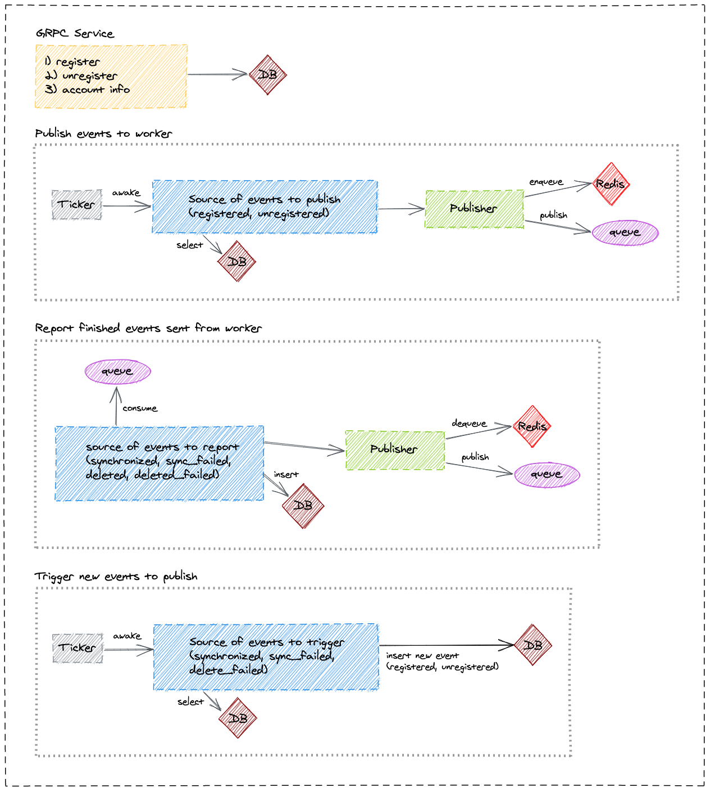

Lama - Account Manager
==========================================================================================================================================================================================

# Getting started
1. Install [sbt][sbt]
2. Clone the repo
3. Install [PostgreSQL][postgresql] and configure access for user `lama` and password `serge` (default user and password from `src/main/resources/application.conf`)
4. Create database `lama` and give access to the configured user
5. Apply migration (see [Database migration][database-migration])
5. `sbt test` (optional)
6. `sbt run`

# Database migration

The project uses [flywayt-sbt][flywayt-sbt] to migrate sql scripts in the folder `src/main/resources/db/migration`.

Migrate your database using `sbt flywayMigrate` or clean it using `sbt flywayClean.

# Docker

The plugin [sbt-docker][sbt-docker] is used to build, run and publish the docker image.

The plugin provides these useful commands:

- `sbt docker`:
Builds an image.

- `sbt docker:stage`:
Generates a directory with the Dockerfile and environment prepared for creating a Docker image.

- `sbt docker:publishLocal`:
Builds an image using the local Docker server.

- `sbt docker:publish`
Builds an image using the local Docker server, and pushes it to the configured remote repository.

- `sbt docker:clean`
Removes the built image from the local Docker server.

## Run dockerized Lama Orchestrator
Please have a look on `docker-compose.yml` file for more details on configuration.
This will create a PostgreSql, a RabbitMQ and the latest published image of lama orchestrator.

`docker-compose up`

[sbt]: http://www.scala-sbt.org/1.x/docs/Setup.html
[postgresql]: https://www.postgresql.org/download/
[flywayt-sbt]: https://github.com/flyway/flyway-sbt
[sbt-docker]: https://github.com/marcuslonnberg/sbt-docker
[database-migration]: #database-migration
